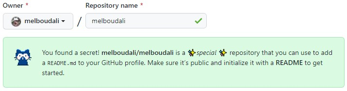
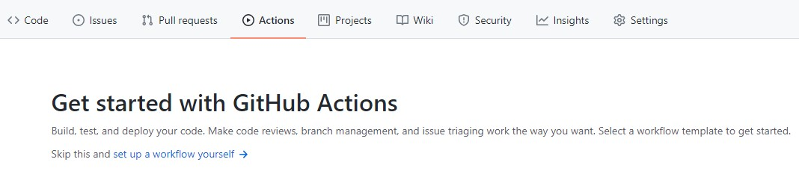
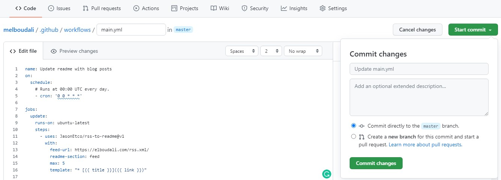
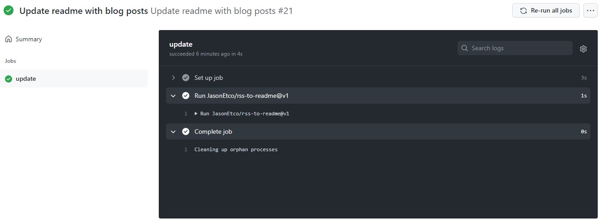
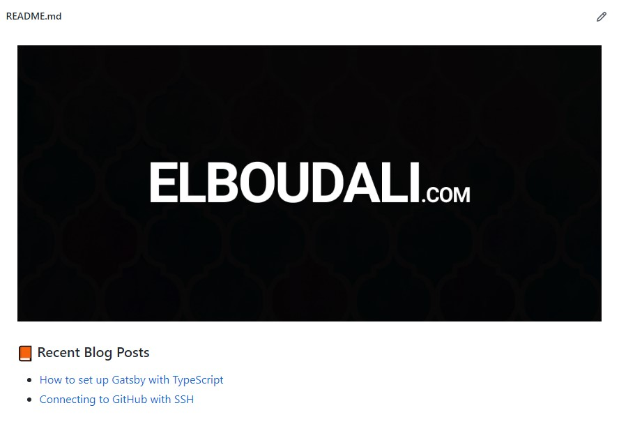

<figure>
  
  <figcaption></figcaption>
</figure>

You can share information about yourself with the community on [GitHub](https://github.com/) by creating a profile `README`. You can also decide what information to include in this file, so you have full control over how you present yourself on GitHub.

Here are some examples of information that visitors may find interesting, fun, or useful in your README file.

- An `About me` section that describes your work and interests.
- Contributions you're proud of, and context about those contributions.
- Guidance for getting help in communities where you're involved.

## Create profile README

Adding your profile readme section is quite simple. All you need to do is create a new repository with your GitHub username **your-github-username/your-github-username** and click `Create repository`.



> The repository must be public.

## Update README

The profile readme only supports static content, but it would be nice to display more dynamic information. My purpose is to be able to display my blog posts. To achieve this you are going to use GitHub Actions.

In addition to that you need a specially marked up readme-section that the action workflow below will use to inject content.

This example uses `<!--START_SECTION:feed--><!--END_SECTION:feed-->` as the target.

```md
### 📙 Recent Blog Posts

<!--START_SECTION:feed-->
<!--END_SECTION:feed-->
```

## Create a GitHub Action

To add a GitHub Action you should go to your repository and click on the `Actions` tab, then `set up a workflow yourself`.



For the sake of demonstration, i will use [my gatsby website](https://elboudali.com/) and [gatsby-plugin-feed](https://www.gatsbyjs.com/plugins/gatsby-plugin-feed/) to generate an `RSS feed`.

> [Click Here](https://www.gatsbyjs.com/docs/how-to/adding-common-features/adding-an-rss-feed/) for more information about `Adding an RSS Feed with Gatsby`.

Next, you can create a GitHub Action and add the following code:

```yml
name: Update readme with blog posts
on:
  schedule:
    # Runs at 00:00 UTC every day.
    - cron: "0 0 * * *"

jobs:
  update:
    runs-on: ubuntu-latest
    steps:
      - uses: JasonEtco/rss-to-readme@v1
        with:
          feed-url: https://elboudali.com/rss.xml/
          readme-section: feed
          max: 5
          template: "* [{{ title }}]({{ link }})"
```

The action will be run according to your defined schedule, It will look for new articles in an `RSS feed` and update your `README.md`.

Next click `Start commit` then `Commit changes`.



here is the screenshot of the GitHub Action running.



And here is the Updated `README` file.



This way you will be able to update your blog posts dynamically into your GitHub readme file with the help of `GitHub Actions`.

Thanks for reading!
