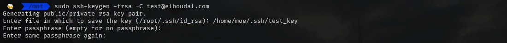
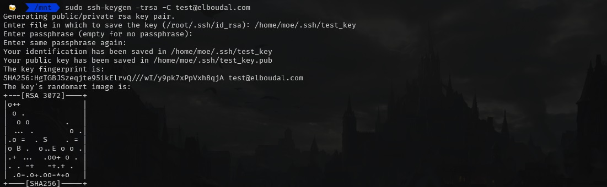
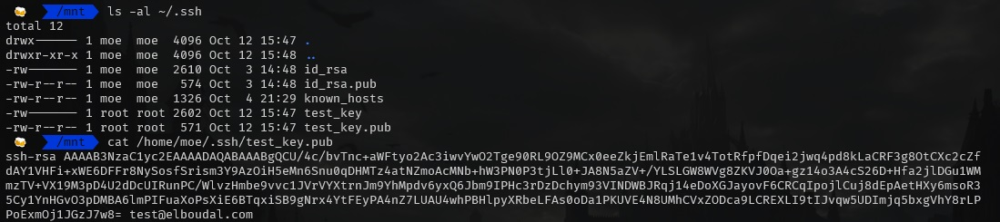
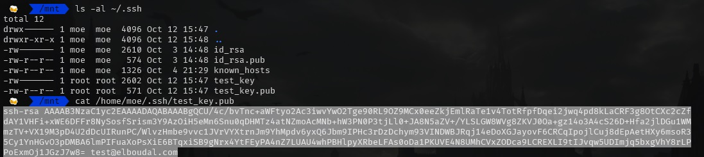
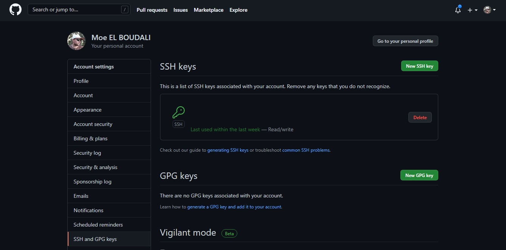

<!-- Don't remove figure -->

<figure>
  
  <figcaption>
    Background from
    <a href="https://unsplash.com/@jamessutton_photography" target="_blank">
      @jamessutton_photography
    </a>
  </figcaption>
</figure>

Using the SSH protocol, you can connect and authenticate to remote servers and services. With SSH keys, you can connect to GitHub without supplying your email and password everytime you push.

When you set up SSH, you will need to generate a new SSH key and add it to the ssh-agent. You must add the SSH key to your account on GitHub before you use the key to authenticate.

# Checking for existing SSH keys

Before you generate an SSH key, you can check to see if you have any existing SSH keys.

- Go to the terminal and type:

  `ls -al ~/.ssh`

it will list down all the ssh keys on your system:

by defaut, the filenames of the public keys are one of the following:

- id_dsa.pub
- id_ecdsa.pub
- id_ed25519.pub
- id_rsa.pub

if the key does not exist, you will have to create a new one.

# Generate the key if it doesn't exist

to generate a new key, you should go to the terminal and type:

`ssh-keygen -trsa -C your-github-email`

if you need root privileges you can type:

`sudo ssh-keygen -trsa -C your-github-email`

enter fil in which to save the key or click enter to accept the default file.

enter the passphrase or click enter to leave it empty.

repeat the same passphrase you entred in the previous step.

you have succefully created an ssh key.

# Copy the public ssh key content

to display the ssh key content go to the terminal and type:

`cat /home/moe/.ssh/test_key.pub`

select and copy the content:

# Add new ssh key to github

Go to [Github](https://github.com/) > settings > SSH and GPG keys or click [here](https://github.com/settings/keys).

> **NB**: If you haven't used your SSH key for a year, then GitHub will automatically delete your inactive SSH key as a security precaution.
