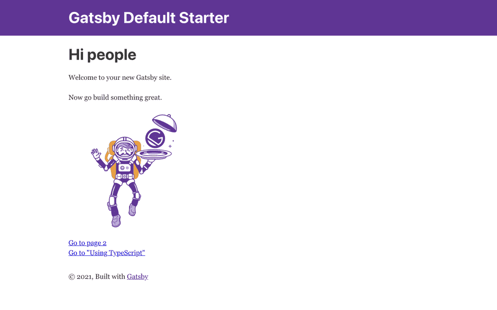

<!-- Don't remove figure -->

<figure>
  
  <figcaption></figcaption>
</figure>

# Introduction

Last year I started integrating TypeScript into all of my projects and workflows. It helped me write better and more predictable code, it is a JavaScript superset which extends the language to include type definitions allowing codebases to be statically checked for soundness.

At the same time, Gatsby has emerged as a useful front-end framework for creating static websites. TypeScript’s static-typing abilities go well with a static-site generator like Gatsby, and Gatsby has built-in support for coding in TypeScript.

Even if Gatsby framework provides an integrated experience out of the box, I found out that there was not enough documentation about their Config Files.

In this article we will take a look on how to set up our Gatsby website and support it fully with Typescript.

# Gatsby setup

First of all, you'll need to install the Gatsby CLI

Open your computer’s console/terminal and run the following command:

```
npm install -g gatsby-cli
```

Create a Gatsby `gatsby-typescript-tutorial` project by running the following command:

```
gatsby new gatsby-typescript-tutorial
```

This will take a few seconds to run as it sets up the necessary boilerplate files and folders for the Gatsby site. After it is finished, `cd` into the project’s directory:

```
cd gatsby-typescript-tutorial
```

Once the installation is completed, you can start your Gatsby app to make sure everything went ok. Run the following commands in your terminal.

```
gatsby develop
```

After a few seconds, you will receive the following message in the console:

```
You can now view gatsby-starter-default in the browser.
⠀
  http://localhost:8000/
⠀
View GraphiQL, an in-browser IDE, to explore your site's data and schema
⠀
  http://localhost:8000/___graphql
⠀
Note that the development build is not optimized.
To create a production build, use gatsby build
```

Usually, the default port is :8000, but you can change this by running:

```
gatsby develop -p another_number instead
```

you can open up a new tab in your browser and navigate to http://localhost:8000 to see the Gatsby app in action.


