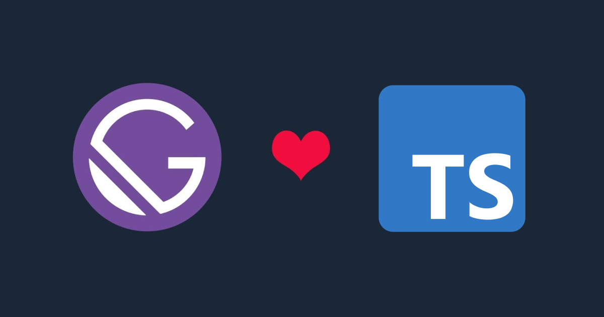

<!-- Don't remove figure -->

<figure>
  
  <figcaption></figcaption>
</figure>

# Introduction

Last year I started integrating TypeScript into all of my projects and workflows. It helped me write better and more predictable code, it is a JavaScript superset which extends the language to include type definitions allowing codebases to be statically checked for soundness.

Even if Gatsby framework provides an integrated experience out of the box, I found out that there was not enough documentation about their Config Files.

In this tutorial we will take a look on how to set up our Gatsby website and support it fully with Typescript.

# Gatsby setup

First of all, you'll need to install the `Gatsby CLI`

Open your computer’s console/terminal and run the following command:

```shell
npm install -g gatsby-cli
```

Create a Gatsby `gatsby-typescript-tutorial` project by running the following command:

```shell
gatsby new gatsby-typescript-tutorial
```

This will take a few seconds to run as it sets up the necessary boilerplate files and folders for the Gatsby site. After it is finished, `cd` into the project’s directory:

```shell
cd gatsby-typescript-tutorial
```

Start your Gatsby app with the following command in your terminal to make sure everything went ok.

```shell
gatsby develop
```

After a few seconds, you will receive the following message in the console:

<!-- ```shell{numberLines: true} -->

```log
You can now view gatsby-starter-default in the browser.
⠀
  http://localhost:8000/
⠀
View GraphiQL, an in-browser IDE, to explore your site's data and schema
⠀
  http://localhost:8000/___graphql
⠀
Note that the development build is not optimized.
To create a production build, use gatsby build
```

Usually, the default port is :8000, but you can change this by running:

```shell
gatsby develop -p another_number instead
```

you can open up a new tab in your browser and navigate to `http://localhost:8000` to see the Gatsby app in action.


Next, you’ll remove all unnecessary files. This includes `gatsby-node.js`, `gatsby-browser.js`, and `gatsby-ssr.js`:

```shell
rm gatsby-node.js
rm gatsby-browser.js
rm gatsby-ssr.js
```

Next, to finish setup, you’re going to remove some boilerplate code from your project’s index page. In your project’s root directory, head to the `src` directory, followed by pages and then open the `index.js` file.

you can delete Link, h1, and p tags. Your file will then look like the following:

```jsx
import * as React from "react";
import { StaticImage } from "gatsby-plugin-image";
import Layout from "../components/layout";
import Seo from "../components/seo";

const IndexPage = () => (
  <Layout>
    <Seo title="Home" />
    <StaticImage
      src="../images/gatsby-astronaut.png"
      width={300}
      quality={95}
      formats={["auto", "webp", "avif"]}
      alt="A Gatsby astronaut"
      style={{ marginBottom: `1.45rem` }}
    />
  </Layout>
);

export default IndexPage;
```

Save and close the file.

Now that you’ve created your project and completed some initial setup, you are ready to install the necessary packages.

# Installing packages

In order to set up support for TypeScript in Gatsby, you’ll need some additional plugins and dependencies, which you will install in this step.

Since your app can read TypeScript files, you can now change Gatsby’s JavaScript files to a TypeScript file extension.

Rename any file inside of `/src` or `/pages` from `.js` to `.tsx`:

```shell
mv src/components/header.js src/components/header.tsx
mv src/components/layout.js src/components/layout.tsx
mv src/components/seo.js src/components/seo.tsx
mv src/pages/index.js src/pages/index.tsx
mv src/pages/page-2.js src/pages/page-2.tsx
mv src/pages/404.js src/pages/404.tsx
```

Its recommended to install types for react, react-dom, node and probably react-helmet. You can install them via npm:

```shell
npm i -D @types/react @types/react-dom @types/node @types/react-helmet
```

And we also need to install ts-node:

```shell
npm i ts-node
```

# Add tsconfig.json file

The `tsconfig.json` file has two primary purposes:

1. Establishing the root directory of the TypeScript project `'include'`.
2. Overriding the TypeScript compiler’s default configurations `'compilerOptions'`.

Create a new file at the root of your directory `'gatsby-typescript-tutorial/'` and name it tsconfig.json.

My `tsconfig.json` file looks like this:

```json
{
  "compilerOptions": {
    "module": "commonjs",
    "target": "es6",
    "jsx": "preserve",
    "lib": ["dom", "es2015", "es2017"],
    "strict": true,
    "noEmit": true,
    "isolatedModules": true,
    "esModuleInterop": true,
    "skipLibCheck": true,
    "noUnusedLocals": true,
    "noUnusedParameters": true,
    "experimentalDecorators": true,
    "emitDecoratorMetadata": true,
    "resolveJsonModule": true,
    "removeComments": false
  },
  "include": ["./src/**/*"]
}
```

> A TSConfig file in a directory indicates that the directory is the root of a TypeScript or JavaScript project. The TSConfig file can be either a `tsconfig.json` or `jsconfig.json`, both have the same set of config variables.

[This page](https://www.typescriptlang.org/tsconfig) covers all of the different options available inside a TSConfig file.

Save this file and close it when you are done.

# Converting Gatsby Config to TypeScript

Remember the `ts-node` package we installed earlier? It’s a handy tool that helps JavaScript files understand TypeScript imports. `register` method is used to register `ts-node` only once and be available in subsequent JS/TS modules.

So, we only need to register it once somewhere up the stream like in `gatsby-config.js`, and it will enable us to import TypeScript modules subsequently. That means we can configure our `gatsby-config` only once, and abstract away all the good parts written in TypeScript.

Let’s open `gatsby-config.js` file and replace its content with this:

```js
"use strict";

require("source-map-support").install();
require("ts-node").register();

module.exports = require("./gatsby-config.ts");
```

- **Source-map-support** mimics node's stack trace making debugging easier.
- **ts-node register** helps importing and compiling TypeScript modules into JS.

The final step is to create the TypeScript version of the config file at the root of your directory `'gatsby-typescript-tutorial/'` and name it `gatsby-config.ts`:

```ts
export default {
  siteMetadata: {
    title: `Gatsby Default Starter`,
    description: `Kick off your next, great Gatsby project with this default starter.`,
    author: `@gatsbyjs`,
    siteUrl: `https://gatsbystarterdefaultsource.gatsbyjs.io/`,
  },
  plugins: [
    `gatsby-plugin-react-helmet`,
    `gatsby-plugin-image`,
    {
      resolve: `gatsby-source-filesystem`,
      options: {
        name: `images`,
        path: `${__dirname}/src/images`,
      },
    },
    `gatsby-transformer-sharp`,
    `gatsby-plugin-sharp`,
    {
      resolve: `gatsby-plugin-manifest`,
      options: {
        name: `gatsby-starter-default`,
        short_name: `starter`,
        start_url: `/`,
        background_color: `#663399`,
        display: `minimal-ui`,
        icon: `src/images/gatsby-icon.png`,
      },
    },
  ],
};
```

# Conclusion

Huge congrats, you successfully achieved 100% type-checked code. I hope this tutorial helps you use Gatsby & Typescript more effectively.

Thank you for your time!
