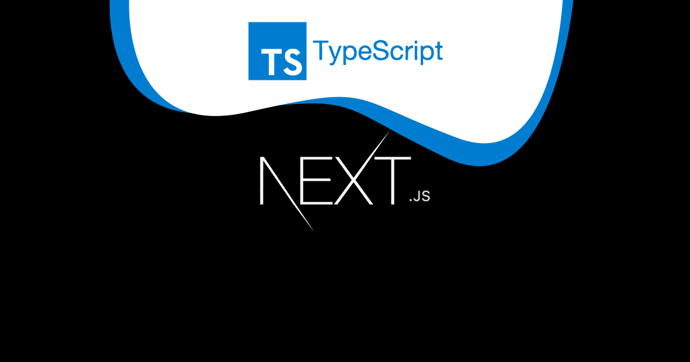
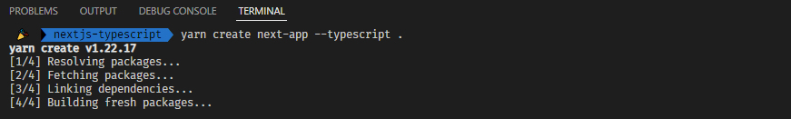

<!-- Don't remove figure -->

<figure>
  
  <figcaption></figcaption>
</figure>

## Introduction

**Next.js** is a _React framework_ to build fast and high-performance applications. It provides an integrated **TypeScript** experience, including zero-configuration set up and built-in types for Pages, APIs, and more.

### Why Next.js?

It's is an open-source web development framework built on top of Node.js enabling React based web applications functionalities and some other handy features such as:

- TypeScript Support
- Automatic Code Splitting
- Server Side Rendering
- Incremental Static Regeneration
- Static Site Generation
- Middlewares
- Automatic Routing w/ API routes
- Prefetching
- Image optimization
- Hot Code Reloading

These features make building SSR, ISR, and SSG React applications easier than ever.

### Why TypeScript?

**Typescript** is a popular language created and maintained by Microsoft. It is a JavaScript superset which extends the language to include type definitions allowing codebases to be statically checked for soundness.

TypeScript seems to be taking over web development. It’s one of the most loved languages, according to the 2021 _developer survey_ by [Stack Overflow](https://insights.stackoverflow.com/survey/2021#most-loved-dreaded-and-wanted-language-love-dread).

In this tutorial we will take a look on how to set up our **Next.js** website and support it fully with **Typescript**.

## Let’s Get Started

**Next.js** provides an integrated TypeScript experience out of the box.

The first thing we need to do is create a new folder named **nextjs-typescript** like so:

```
mkdir nextjs-typescript && cd nextjs-typescript
```

You can create a **TypeScript** project with `create-next-app` using the `--ts`, `--typescript` flag like so:

```
npx create-next-app@latest --ts
```

**or**

```
yarn create next-app --typescript
```

But if you want to install nextjs inside the current folder use:

```
yarn create next-app --typescript .
```



### Existing projects

Usually adding **TypeScript** to any project requires you to have a `tsconfig.json` file, which sits at the root folder.The `tsconfig.json` file specifies the compiler options required to compile the project.

#### Create tsconfig.json

To get started, create an empty [tsconfig.json](https://www.typescriptlang.org/docs/handbook/tsconfig-json.html) file in the root of your project:

```
touch tsconfig.json
```

Now, try **starting/restarting** the development server (`npm run dev` or `yarn dev`). It will give you a _warning_ that says something like below:

```
It looks like you're trying to use TypeScript but do not have the required package(s) installed.
```

Follow the instructions to install TypeScript:

- If you’re using **npm**

  ```
  npm install --save-dev typescript @types/react @types/node
  ```

- If you’re using **Yarn**

  ```
  yarn add --dev typescript @types/react @types/node
  ```

Now, try **starting** the development server again. After starting the server, Next.js will:

- **Populate** the `tsconfig.json` file for you. You may customize this file.
- **Create** the `next-env.d.ts` file, which ensures Next.js types are picked up by the TypeScript compiler. You should not touch this file.

You can now use **TypeScript** for your **Next.js** app.

## Next.js Specific Types

Here are some Next.js specific types you can use.

### Static Generation and Server-side Rendering

For **getStaticProps**, **getStaticPaths**, and **getServerSideProps**, you can use the `GetStaticProps`, `GetStaticPaths`, and `GetServerSideProps` types respectively:

```ts
import type { GetStaticProps, GetStaticPaths, GetServerSideProps } from "next";

export const getStaticProps: GetStaticProps = async (context) => {
  // ...
};

export const getStaticPaths: GetStaticPaths = async () => {
  // ...
};

export const getServerSideProps: GetServerSideProps = async (context) => {
  // ...
};
```

### API Routes

The following is an example of how to use the built-in types for [API routes](https://nextjs.org/docs/api-routes/introduction):

```ts
import type { NextApiRequest, NextApiResponse } from "next";

export default (req: NextApiRequest, res: NextApiResponse) => {
  // ...
};
```

### Custom "App"

You can convert `pages/_app.js` into `pages/_app.tsx` and use the built-in type `AppProps`, like so:

```ts
import type { AppProps } from "next/app";

const MyApp = ({ Component, pageProps }: AppProps) => <Component {...pageProps} />;

export default MyApp;
```

### NextPage Type

`NextPage` is a type exported by **NextJS**. When we write `Page: NextPage` we're saying that our Page component is of type `NextPage`:

```ts
import type { NextPage } from "next";

const Page: NextPage = () => {
  // ...
};

export default Page;
```

#### With Props

```ts
import type { NextPage } from "next";

interface Props {
  // ...
}

const Page: NextPage<Props> = (props) => {
  // ...
};

export default Page;
```

## Conclusion

Huge congrats, check out the [Github repo](https://github.com/melboudali/Next.js-tutorials) to view the source code. I hope this tutorial helps you use NextJS & Typescript more effectively.

Thank you for your time!
